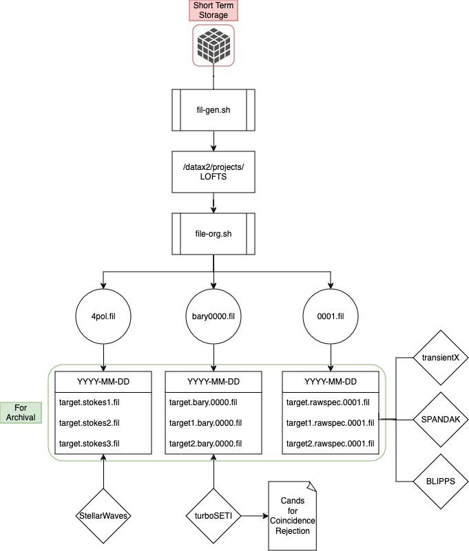

# LOFTS Pipeline 

## Overview

This contains the pipeline scripts used on the Breakthrough Listen backeneds of IE613 and SE607 in the generation and analysis for the Low Frequency Technosignature, FRB and Pulsar Survey. An overview of the pipeline is shown below.

## Filterbank Generation 

The first part of the pipeline requires the generation of science ready data products. This is done using the `filterbank-gen-lofts.sh` script. This script takes voltages from each of the four lanes and calls `lofar_udp_extractor`. The udpPacketManager combines and manages high-speed data streams from LOFAR stations (1), unpacks and reorganizes the data for scientific use (2), converts it into various formats like PSRDADA and HDF5 (3), processes data both in real-time and offline (4), supports features like downsampling and calibration (5), and provides command-line interfaces for easy access and specialized processing (6). This software was written by Dr. David McKenna and is detailed in this [paper](https://arxiv.org/pdf/2309.03228).

The pipeline then calls [`rawspec`](https://github.com/UCBerkeleySETI/rawspec) to generate filterbanks from GUPPI RAW files. `rawspec` requries the fine channels and integration blocks to be specified. The raw data is structured into blocks where each block contains,  
- 2 polarizations
- 412 coarse channels
- 65,536 time samples  

Things to note about using `rawspec` on LOFAR data: 
- It is important that the largest `-f` value (fine channels per block) is a factor of the block's time samples (65,536).
- `-t` must be a multiple or factor of the fine channels (8192). For example, a `-t` value of 16 leads to 512 integrations per block for that product.
- Integrating across two blocks (i.e., `-t 2`) ensures that each output contains data from two blocks. If the total data isn’t a multiple of 2, the last block’s data won’t be output to avoid incomplete (or "runt") integrations.
- Mixing polarization products can be controlled using the `-p` option (e.g., `-p 1,1,4` for combining different polarization settings).

For custom data products, the following expressions can be used to determined values for `-f` and `-t`:
- $\text{chans} = \frac{\text{block channels}}{\texttt{f}}, \quad \text{chans} \mid x, \quad \frac{\text{chans}}{\texttt{t}} \mid x$
- $f_\text{res} =   (\text{Bandwidth}/\text{Coarse Channels})/\text{Fine Channels}$
- $t_\text{res} = 5.12 \times 10^{-6} \times \text{fine channels} \times \text{integrations}$

Also `rawspec-calculator.py` can be used to calculate the frequency and time resolution for a given `-f` and `-t` value. 

| **Product**              | **-f**     | **-t** | **Frequency Resolution** | **Time Resolution** | **File Suffix**  | **Polarisation** | **Science Case**                                                         |
|--------------------------|------------|--------|--------------------------|---------------------|------------------|------------------|-------------------------------------------------------------------------|
| **High Frequency Product** | 65536     | 54      | 3.33 Hz                  | 18.119 s            | 0000.fil           | I              | **Technosignature Searching**: Detecting drifting narrowband signals.    |
| **Mid Frequency Product**  | 64        | 3072    | 3.41 kHz                 | 1.006 s             | 0002.fil             | I, Q, U, V              | **Broadband Emission Studies**: Observing wideband emissions from solar flares, planetary radio emissions, or periodic spectral signals. |
| **Low Frequency Product**  | 8         | 16      | 27.31 kHz                | 0.655 ms            | 0001.fil              | I            | **Transient Detection**: Suitable for detecting FRBs and RRATs.          |

Finally using the `filterbank-gen-lofts.sh`. The script is simple to run and used as follows: `bash filterbank-gen-lofts.sh /datax/Projects/proj21/sess_sid20240723T200200_SE607`. 

### Filterbank Cleaning 

The filterbanks generated generate `.raw` files that are substaintial in size. In addition to this voltages (`.zst`) are also large. The `voltage-cleaner.sh` script checks that the filterbanks for each target in a rawfile path has it accompanying filterbanks. It then checks the size of the filterbanks to infer if the generation was successful (it is still recommended to eye file sizes before running this script). If both conditions are met the script will remove the `.raw` and `.zst` files. The script is used in the same manner as the filterbank generation script, an example usage: `bash voltage-cleaner.sh /datax/Projects/proj21/sess_sid20240723T200200_SE607`.